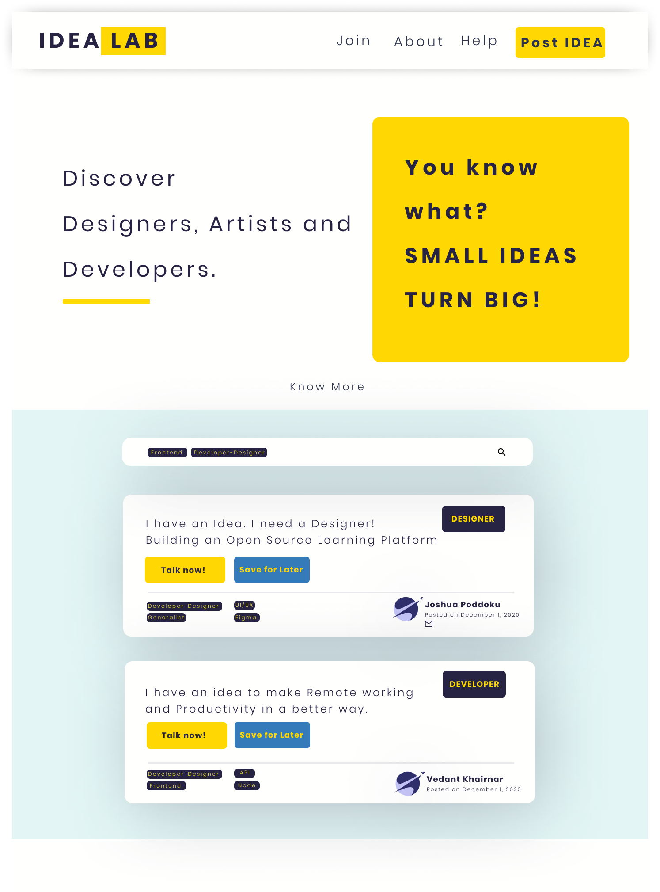

# Idea Lab 💡
Collaborative space for developers, designers and artists to share and work with their ideas.  

- [Why Idea Lab?](#why-idea-lab)
- [Initial Idea](#initial-idea)
- [Tech Stack](#tech-stack)
- [Contributing Guide](#contributing-guide)
- [Contributors](#contributors)
- [Author](#author)

## Why Idea Lab?

- If a Developer needs a Designer who wants to work on an Open-Source or Paid Project, he has to hop on LinkedIn.
  *Idea lab can help to connect with Developers, Artists, Designers who are like-minded to work on the right idea.* 

## Initial Idea

## Tech Stack

- Coming soon .. 🚀	

## Contributing Guide

- Add an issue to become a collaborator/ contributor
- UI Designers, Frontend & Backend Developers

## Contributors

- Coming soon .. 🚀	

## Author
- Twitter: [@JoshuaPoddoku](https://twitter.com/JoshuaPoddoku)
- Github: [@JoshuaPoddoku](https://github.com/JoshuaPoddoku)
- LinkedIn: [JoshuaPoddoku](https://www.linkedin.com/in/joshua-poddoku/)

- Website: joshuapoddoku.github.io
